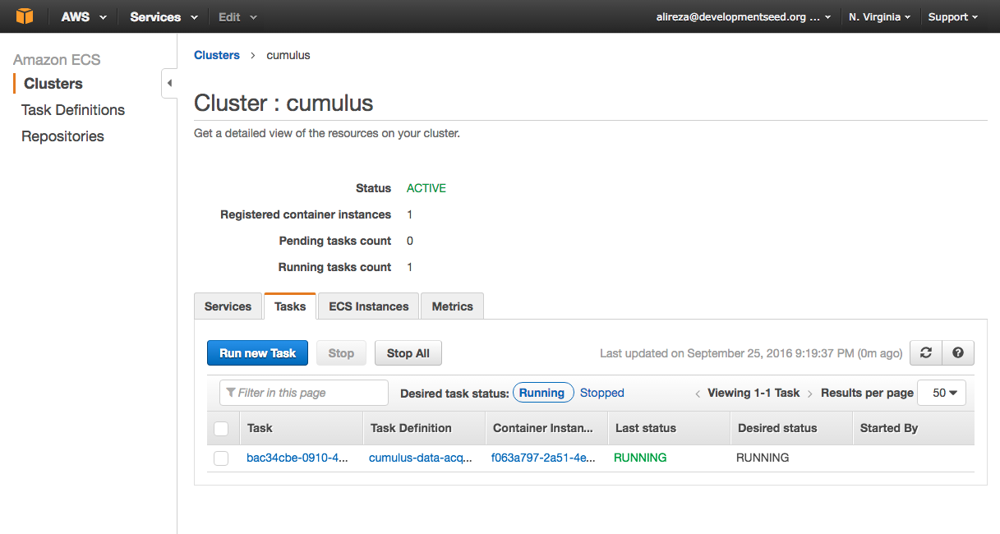

# Components

## Workflow Engine

- **Language:** NodeJs
- **Runs on:** AWS APIGateway and Lambda Functions
- **Deployment:** CloudFormation Templates via Serverless module
- **Public API endpoint**: [https://x6vgaj6m9d.execute-api.us-east-1.amazonaws.com/dev](https://x6vgaj6m9d.execute-api.us-east-1.amazonaws.com/dev)

Workflow Engine is a collection of separate AWS Lambda functions that handle a variaty of tasks. The primary functions of Workflow Engine are:

It powers the Dashboard and End-to-End tests. Operators of Cumulus work with Workflow Engine directly through the API endpoints or via the Dashboard.

- Defines and Deploys the schema defintion of all DynamoDB tables that are used accross the platform
  - Defines fixtures for populating the tables with preliminary records
- Triggers AWS Datapipelines for each collection on a scheduled and on demand basis
- Provides API endpoint for listing and searching collections, granules and datapipeline
- Provides API endpoints for listing errors
- Provides API endpoints for system statistics

For more information on how to test, deploy and develop this component [go to here](https://github.com/cumulus-nasa/workflow-engine)

## Data Acquisition App

- **Language:** Python
- **Runs on:** AWS EC2 Container Service
- **Deployment:** via Docker

The data acquisition app downloads the latest granules from HS3 FTP servers.

The script has a CLI that allow the user to select which HS3 collection has to be downloaded and whether the granules have to be redownloaded if they are already in the system.

For more information on how to test the app locally and develop it further [go to here](https://github.com/cumulus-nasa/docker-data-acquisition).

### Test on AWS ECS

To test the download mechanism on AWS ECS service, go to `cumulus-tests` repo and run:

    $ ./test.js wwlln -m download

Replace `wwlln` with one of the other 5 collections if needed.

If you have access to AWS ECS control panel, you can also go to https://console.aws.amazon.com/ecs/home?region=us-east-1#/clusters/cumulus/tasks to view active tasks.

## Data Distribution App

- **Language:** NodeJs
- **Runs on:** AWS APIGateway and Lambda Functions
- **Deployment:** CloudFormation Templates via Serverless module
- **Public API endpoint**: [https://72a8qx4iva.execute-api.us-east-1.amazonaws.com/dev](https://72a8qx4iva.execute-api.us-east-1.amazonaws.com/dev)

The data distribution app is an AWS API Gateway instance that allows users to download granule files from an otherwise-protected S3 bucket. The app authorizes one-off downloads of those granule files based on an EarthData Login OAuth exchange, wherein the user must provide EarthData with their credentials. An overview of this process [is outlined in the EarthData Login docs](https://urs.earthdata.nasa.gov/sso_client_impl).

For more information [go to here](https://github.com/cumulus-nasa/data-distribution)

## Metadata Push to CMR

- **Language:** Python
- **Runs on:** AWS Data Pipeline Service
- **Deployment:** via Docker

This scripts takes a full directory path as an argument, and pushes all of that directory's XML files up to NASA's Common Metadata Repository. Its main dependency is on pyCMR, a Python API wrapper published by the GHRC DAAC.

For more information [go to here](https://github.com/cumulus-nasa/docker-metadata-push)

This app is deployed as one of the processing steps of HS3 collections in a data pipeline. Here is [an example](https://github.com/cumulus-nasa/workflow-engine/blob/develop/src/pipeline/builder.js#L191) of how this step is defined inside a datapipeline.

## Archiver

- **Language:** NodeJs
- **Runs on:** AWS Data Pipeline Service
- **Deployment:** via Docker

