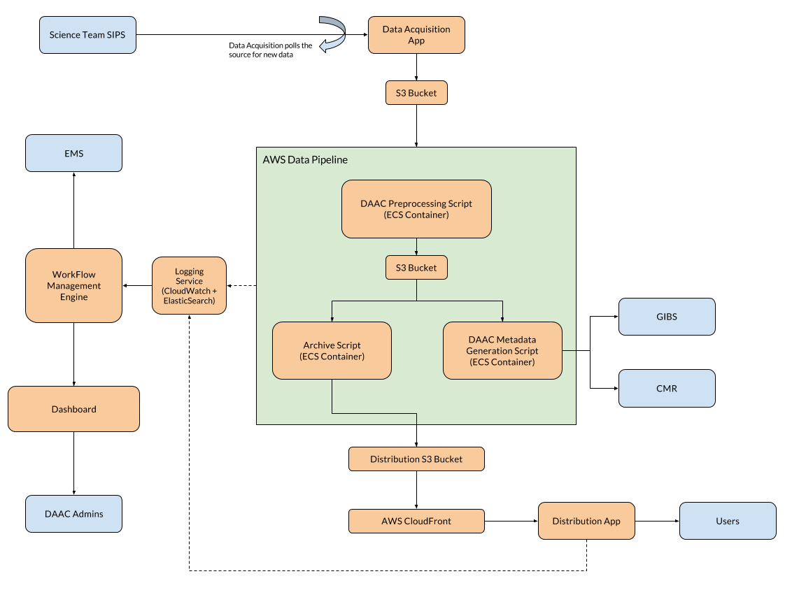

# Technical Approach

*[Last Updated: Sept 23, 2016]*

Our proposed approach is designed to build a Cumulus prototype platform that can be used to prove concept viability; provide a testbed to see potential implementation issues early on; and serve as a base to build on in future phases.

The major components of the Cumulus prototype system are:

| Component                  | Language     | AWS Services        | Maintainer |
|----------------------------|--------------|---------------------|------------|
| Data Acquisition           | Python       | AWS EC2 Container   | Devseed    |
| Pipeline Process           | JSON         | AWS Data Pipeline   | Devseed    |
| Dashboard          | HTML + JS  | S3          | Devseed    |
| Dockerized Code      | Docker Python | AWS EC2 Container | Devseed |
| Workflow Engine      | NodeJs       | Lambda, API Gateway, DyanmoDB| Devseed  |
| Data Distribution      | NodeJs   | Lambda, API Gateway, DyanmoDB| Devseed  |

This diagram shows how the components work with each other as a platform:

**The Diagram is not up-to-date**

